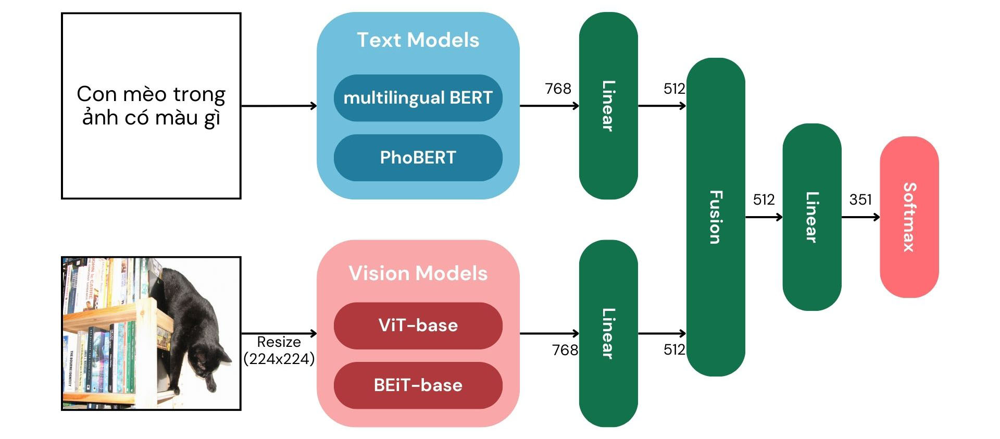
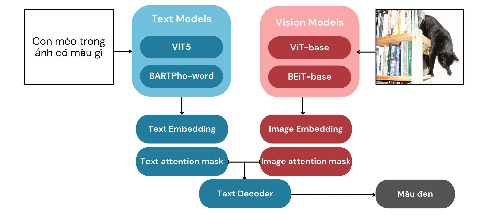
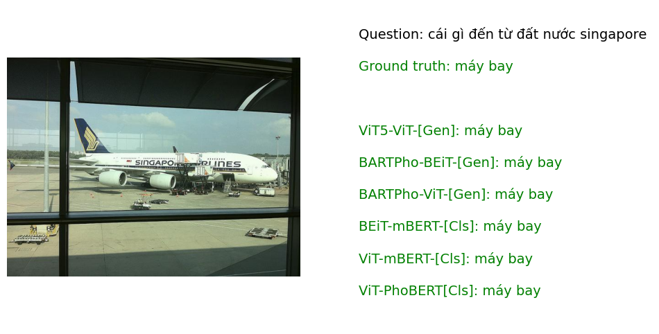
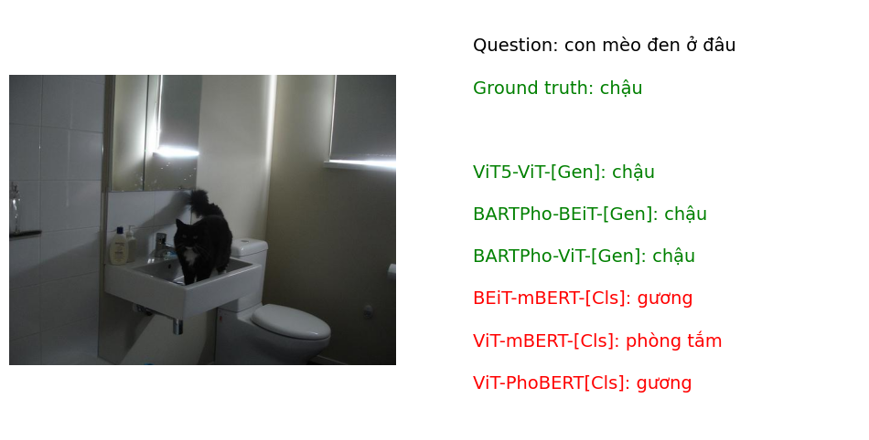
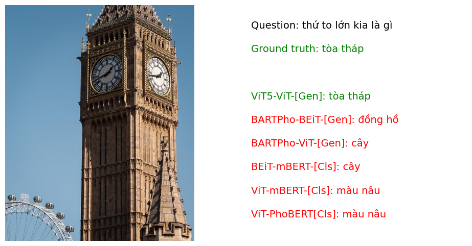

# Vietnamese Visual Question Answering

Classification and Generation models for Vietnamese Visual Question-Answering task

# Dataset

### [ViVQA: Vietnamese Question Answering Dataset](https://aclanthology.org/2021.paclic-1.72/)

ViVQA is a new dataset for evaluating Vietnamese VQA models. The ViVQA dataset consists of 10,328 images and 15,000 pairs of questions and answers in Vietnamese corresponding to the content of the images. On the ViVQA dataset, the authors also propose a system that uses the Hierarchical Co-Attention Model and achieves Accuracy: 0.3496, WUPS 0.9: 0.4513 and WUPS 0.0: 0.7786.

After preprocessing, the dataset has 14,806 pairs of question-answer and is divided into 3 subsets:

- Training set: 9,455 samples
- Validation set: 2,364 samples
- Test set: 2,987 samples

# Models

For the VQA task, I tried implement 2 types of models: classification and text generation.

## Classification Model

First, I build a vocab for all answers in dataset, the vocab has 351 unique answers

The VQA task needs to extract features from both text and images, so it requires a combination of both text and vision models.

With text models, I tried using pretrained [multilingual BERT](https://github.com/google-research/bert) and [PhoBERT-base](https://github.com/VinAIResearch/PhoBERT) for extract text features.

With vision models, I tried using pretrained [ViT-base](https://huggingface.co/google/vit-base-patch16-224) and [BEIT-base](https://huggingface.co/microsoft/beit-base-patch16-224-pt22k-ft22k) for extract image features.

The workflow of the model is as shown below:

## Text Generation Model

Similar to the classification models, I keep the same 2 vision models. For text models, I tried using 2 pretrained models with support conditional generation is [VietAI/ViT5](https://huggingface.co/VietAI/vit5-base) and [BARTPho-word](https://github.com/VinAIResearch/BARTpho)

The workflow of the model is as shown below:

# Results

| Type           | Text Model | Vision Model | Params | WUPs       | EM         | F1         | CIDEr      |
| -------------- | ---------- | ------------ | ------ | ---------- | ---------- | ---------- | ---------- |
|Classification <td colspan=2>Hierarchical Co-Attention (baseline)|-|-|0.3496 |-|-|
| Classification | PhoBERT    | ViT          | 222M   | 0.4646     | 0.4646     | 0.5157     | 2.0841     |
| Classification | mBERT      | ViT          | 254M   | 0.5327     | 0.5327     | 0.5994     | 2.3944     |
| Classification | mBERT      | BEiT         | 253M   | 0.4607     | 0.4607     | 0.5031     | 2.0601     |
| Generation     | ViT5       | ViT          | 396M   | 0.5112     | 0.5112     | 0.5849     | 2.3538     |
| Generation     | BARTPho    | ViT          | 384M   | 0.4975     | 0.4975     | 0.5788     | 2.1874     |
| Generation     | BARTPho    | BEiT         | 384M   | **0.5698** | **0.5698** | **0.6269** | **2.6186** |

### Examples

# References

1. [VinAIResearch/PhoBERT](https://github.com/VinAIResearch/PhoBERT)
2. [VinAIResearch/BARTpho](https://github.com/VinAIResearch/BARTpho)
3. [vietai/ViT5](https://github.com/vietai/ViT5)
4. [hieunghia-pat/OpenViVQA](https://github.com/hieunghia-pat/OpenViVQA)
